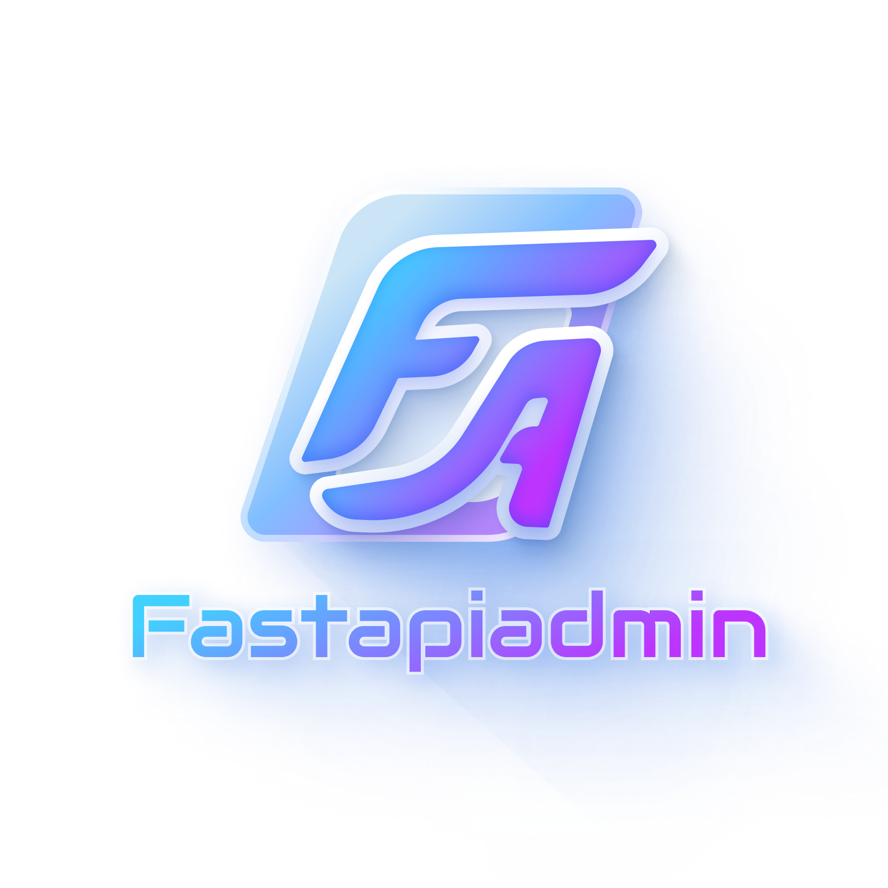
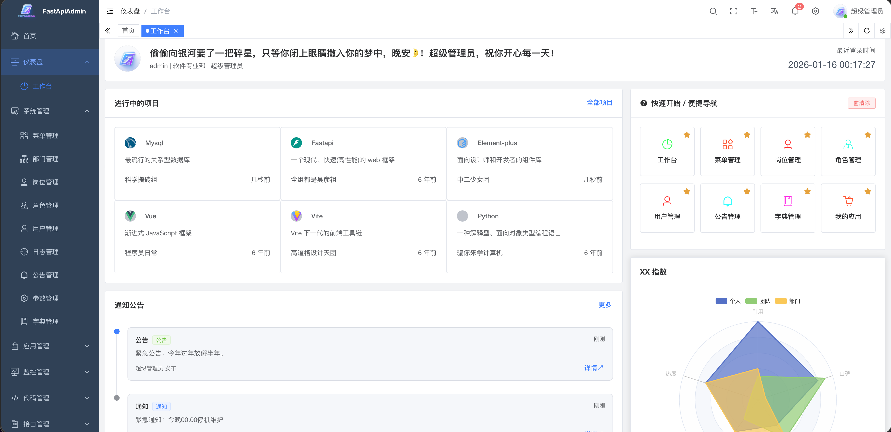
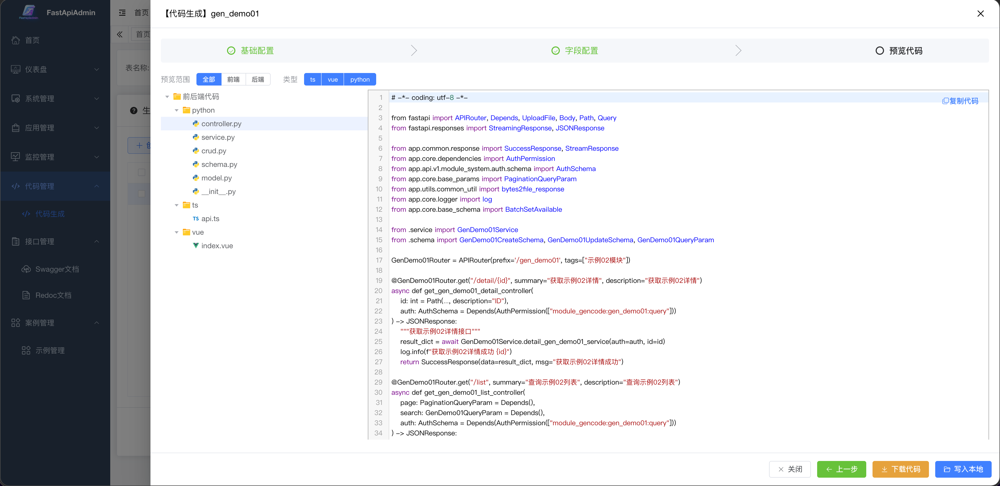
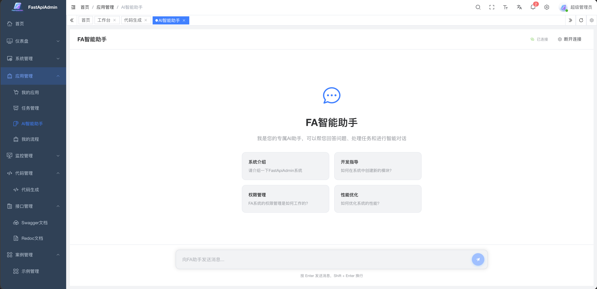

<div align="center">
     <p align="center">
            
     </p>
     <h1>FastCloud <sup style="background-color: #28a745; color: white; padding: 2px 6px; border-radius: 3px; font-size: 0.4em; vertical-align: super; margin-left: 5px;">v2.0.0</sup></h1>
     <h3>Modern Full-Stack Rapid Development Platform</h3>
     <p>If you like this project, please give it a ⭐️ to show your support!</p>
     <p align="center">
          <a href="https://gitee.com/fastapiadmin/FastCloud.git" target="_blank">
               
          </a>
          <a href="https://github.com/fastapiadmin/FastCloud.git" target="_blank">
               
          </a>
          <a href="https://gitee.com/fastapiadmin/FastCloud/blob/master/LICENSE" target="_blank">
               
          </a>
           
           
           
           
           
           
           
     </p>

English | [简体中文](./README.md)

</div>

## 📘 Project Introduction

**FastCloud** is a lightweight version of FastapiAdmin, designed to help developers efficiently build high-quality enterprise-level backend systems. This project adopts a **frontend-backend separation architecture**, integrating the Python backend framework `FastAPI` and the mainstream frontend framework `Vue3` to achieve unified development across multiple terminals, providing a one-stop out-of-the-box development experience.

> **Design Philosophy**: With modularity and loose coupling at its core, it pursues rich functional modules, simple and easy-to-use interfaces, detailed development documentation, and convenient maintenance methods. By unifying frameworks and components, it reduces the cost of technology selection, follows development specifications and design patterns, builds a powerful code hierarchical model, and comes with comprehensive local Chinese language support. It is specifically tailored for team and enterprise development scenarios.

<a id="packaging-philosophy"></a>

## 📐 Packaging Philosophy: Two Organization Methods and This Project's Choice

This discusses **how to divide source code directories** (how to package folders), which is not the same as whether to implement MVC / Controller–Service–CRUD **logical layering** in code: layering can exist, and this project still has it; the difference lies in whether the **first layer** is divided by "business domain" or "technical layer".

| Method | Organization | Typical Directory (Example) |
|--------|--------------|----------------------------|
| **Package by Technical Layer** (package by layer) | Group files of the same technical type together | Top-level `models/`, `schemas/`, `cruds/`, `services/`, `controllers/` … |
| **Package by Business Feature** (package by feature / vertical slice) | Group files of the same business domain together | Under backend `app/api/v1/module_*/<subdomain>/`: `controller.py`, `service.py`, `crud.py`, `model.py`, `schema.py`; optional capabilities in `app/plugin/...` |

**This project (backend) uses: Package by Business Feature (vertical slice).**

**Design Philosophy (Why This Choice)**

- **Decoupling Unit is Business Boundary**: Modules such as system management, monitoring, and various business subdomains; files are further divided within subdomains; during multi-person collaboration, try to work in different subdirectories to reduce unrelated conflicts, rather than everyone modifying the same global `models/` and `services/`.
- **Future-Oriented Splitting**: If a module needs to be separated into an independent sub-project, independent repository, or independent release in the future, **an entire directory** is a natural boundary; package by layer often requires extraction across multiple top-level directories, resulting in higher migration costs.
- **Layering Still Exists**: The **logical layering** of Controller → Service → CRUD → Model / Schema has not disappeared; it is just **nested within business packages** rather than using "a single layered directory for the entire project" as the first dimension of division.

**Trade-off with Package by Layer**: Package by layer also has its value when "small teams emphasize overall browsing of a technical layer"; this project clearly adopts **vertical slicing by feature** under the premise of **prioritizing domain decoupling and multi-team parallel work by module**. If you are more concerned with viewing the entire table structure at a glance in a single repository, you can use IDE, database tools, and Alembic instead of changing to a global `models/` single directory for this purpose.

---

## 🎯 Core Advantages

| Advantage | Description |
| -------- | ----------- |
| 🔥 **Modern Tech Stack** | Built based on cutting-edge technologies such as FastAPI + Vue3 + TypeScript |
| ⚡ **High Performance Asynchronous** | Utilizes FastAPI's asynchronous features and Redis caching to optimize response speed |
| 🔐 **Secure and Reliable** | JWT + OAuth2 authentication mechanism, RBAC permission control model |
| 🧱 **Modular Design** | Highly decoupled system architecture for easy expansion and maintenance |
| 🌐 **Full-Stack Support** | Integrated solution for Web + Mobile(H5) + Backend |
| 🚀 **Rapid Deployment** | One-click Docker deployment, supporting quick production environment launch |
| 📖 **Comprehensive Documentation** | Detailed development documentation and tutorials to reduce learning costs |
| 🤖 **Intelligent Agent Framework** | Development intelligent agent based on Agno |

## 🍪 Demo Environment

- 💻 Web: [https://service.fastapiadmin.com/web](https://service.fastapiadmin.com/web)
- 📱 Mobile: [https://service.fastapiadmin.com/app](https://service.fastapiadmin.com/app)
- 👤 Login Account: `admin` Password: `123456`


## 📦 Engineering Structure Overview

```sh
FastapiAdmin
├─ backend               # Backend project (FastAPI + Python)
├─ frontend              # Web frontend project (Vue3 + Element Plus)
├─ LICENSE               # Open source license
|─ README.en.md          # English documentation
└─ README.md             # Chinese documentation
```

## 🔧 Module Display

### Web

| Module <div style="width:60px"/> | Screenshot |
| ----- | --------- |
| Dashboard |  |
| Code Generation |  |
| Intelligent Assistant |  |


## 🚀 Quick Start

### Environment Requirements

| Type | Tech Stack | Version |
|------|------------|---------|
| Backend | Python | ≥ 3.10 (3.12 recommended) |
| Backend | FastAPI | 0.109+ |
| Frontend | Node.js | ≥ 20.0 |
| Frontend | Vue3 | 3.3+ |
| Database | SQLite | See `backend/env` configuration |

### Get the Code

```bash
# Clone the code to local
git clone https://gitee.com/fastapiadmin/FastCloud.git
# Or
git clone https://github.com/fastapiadmin/FastCloud.git
```

### Backend Startup

#### Using uv (Recommended, consistent with `backend/pyproject.toml`)

```bash
cd backend
uv sync
# Start
uv run main.py run
```

#### Using traditional pip / venv

```bash
cd backend
python -m venv .venv
# Windows: .venv\Scripts\activate
# macOS/Linux: source .venv/bin/activate
pip install -r requirements.txt
python main.py run
```

### Frontend Startup

#### Using pnpm or npm

```bash
cd frontend
pnpm install
# Start
pnpm dev
# Build production version
pnpm build
```

## ℹ️ Help

For more details, please check the [Official Documentation](https://service.fastapiadmin.com)

## 👥 Contributors

<a href="https://github.com/fastapiadmin/FastCloud/graphs/contributors">
  
</a>

## 🙏 Special Thanks

Thanks to the contributions and support of the following open-source projects:

- [FastAPI](https://fastapi.tiangolo.com/)
- [Pydantic](https://docs.pydantic.dev/)
- [SQLAlchemy](https://www.sqlalchemy.org/)
- [Vue3](https://cn.vuejs.org/)
- [TypeScript](https://www.typescriptlang.org/)
- [Vite](https://github.com/vitejs/vite)
- [Element Plus](https://element-plus.org/)

## 🎨 Community Exchange

| Group QR Code | WeChat Pay QR Code |
| --- | --- |
|  |  |

## ❤️ Support the Project

If you like this project, please give it a ⭐️ Star to show your support! Thank you very much!

[](https://starchart.cc/fastapiadmin/FastCloud)